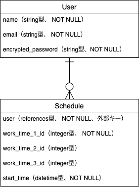

# アプリケーション名
Ours

# アプリケーション概要
パート、アルバイトスタッフのシフト提出が可能で、それを基に管理側が作成、確定、共有することができる。

# URL

# テスト用アカウント
・Basic認証パスワード：  
・Basic認証ID：  
<スタッフ用アカウント>  
・メールアドレス：  
・パスワード：  
<管理者アカウント>  
・メールアドレス：  
・パスワード：  

# 利用方法
## シフト提出
1. トップページ（一覧ページ）のヘッダーからユーザー新規登録を行う。またはスタッフ用アカウントを使用しログインする。
2. トップページのカレンダー内にある「<提出する>」ボタンから該当日のシフト（日付、名前、第一〜第三希望）を入力し提出する。

## シフト作成
1. 管理者アカウントでログインを行う。
2. スタッフがシフト提出済みの日付の詳細表示へ変遷する。
3. 提出されたシフトの編集を行う。
4. 該当月のページへ変遷し、カレンダーの右上にある「シフト確定」ボタンを押す。

## シフト確認
1. トップページ（一覧ページ）のヘッダーからログイン（アカウント不問）を行う。
2. 該当月のページへ変遷し、確認する。

# アプリケーションを作成した背景
前職において、パート登録スタッフのシフト管理に必要以上に時間と手間がかかっていた。業界的に高齢スタッフが多く、メール操作ができなかったり、スマートフォンを持っていなかったり、シフト連絡をFAXで行わないといけない場合もあった。そのため、ガラケーや自宅PCでもシフト提出、確認を容易な手順で行うことができれば、パートスタッフ側のシフト提出の負担を減らし、管理側の作業も効率化できると考え、アプリケーションを開発することにした。

# 実装した機能についての画像やGIFおよびその説明

# 実装予定の機能
現在、シフト管理機能を実装中。
今後は、ガラケービュー（一覧表示をカレンダー表記ではなくリスト表記で実装）、操作への対応や勤怠管理システムとの連携を実装予定。

# データベース設計

# テーブル設計

## usersテーブル

| Column             | Type   | Options     |
| ------------------ | ------ | ----------- |
| name               | string | null: false |
| email              | string | null: false |
| encrypted_password | string | null: false |

### Association
- has_many :schedules

## schedulesテーブル

| Column         | Type       | Options                        |
| -------------- | ---------- | ------------------------------ |
| user           | references | null: false, foreign_key: true |
| work_time_1_id | integer    | null: false                    |
| work_time_2_id | integer    |                                |
| work_time_3_id | integer    |                                |
| start_time     | datetime   | null: false                    |

### Association
- belongs_to :user
- belongs_to :work_time_1
- belongs_to :work_time_2
- belongs_to :work_time_3

# 開発環境
・フロントエンド
・バックエンド
・インフラ
・テスト
・テキストエディタ
・タスク管理

# ローカルでの動作方法

# 工夫したポイント
・高齢スタッフの使用を考慮し、可能な限りシンプルでわかりやすく操作ができるように実装した。
・パケット通信料を抑えるために必要以上の画像やアイコンは使用しない。

※ 機能実装(追加実装機能を除く)後、デプロイ予定です。  
※ 初のオリジナルアプリのため、ブランチの切り方や順序がバラバラです。ある程度機能実装後、学習のために手順も見直しながら作り直す可能性があります。URLは変わらないと思いますが、万が一変更がある場合はお伝えします。